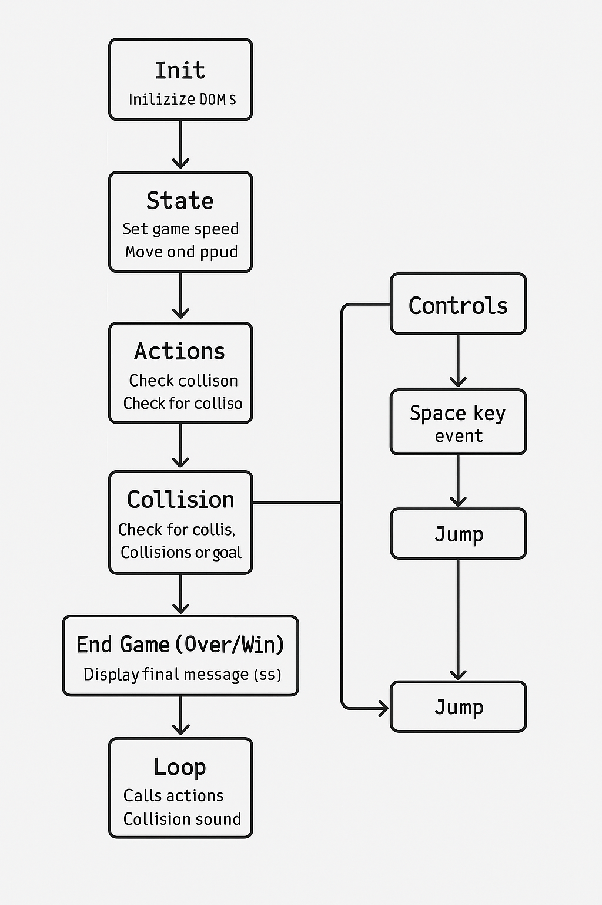

# Panda-Retro Jumping Game - 🎮

# Objective

This repository is basically just a jumping game model 2D that allows you to easily understand how the mechanics work. 

## Stack

Used technologies:

### Features

HTML Canvas element as container for graphics, then using a script for the drawing.

→ play area with the panda (player), spour water (obstacle), and yatch (goal), Retro effect.

 → game-over message
 → easy instructions 

CSS3 handles the layout and visuals: Background gradient for the water/sky Panda, boat, and fountain displayed as images (background: url ( ...) )

Positioning: Flex, Grid rAF , TOTAL_LAPS, responsivness.

JavaScript manages the game logic:

Variables for player, obstacle, goal, score, game speed

A loop that moves the spour water across the screen. The loop:  * Moves the obstacle * Checks collisions * updates score/game state. 

👩🏽‍💻 Capturing Events.

Collision detection: if the panda hits the spour water → Game Over

Win condition: if the panda reaches the yatch → You Win!

Fully responsive as we use relative size in css.
Initialization

initDOM() → grabs your HTML elements.

initSounds() → loads your audio files.

resizeGame() → sets JUMP_HEIGHT, obstacle width, game speed.

Controls

Event listeners (keydown + click) call jump().

On resize, it recalculates the game size.

Game Loop - Call actions- collitions.

movePlayerForward() → Panda walks.

updateObstaclePosition() → moves obstacle.

checkCollision() → checks hit obstacle or reached goal.

jump() → Panda jump logic + sound.

End Game: endGame(win) → shows "YOU WIN" or "GAME OVER", plays sound.

# Views 

Some of the views can be seen  below: 

> [!CAUTION] ⚠️
> The panda cannot double jump (yet 😉).

# Future improvements 

Summary in a nutshell:

- Levels with speed scaling →  for challenge. 
- Using JavaScript´s ES6 
- Lives + animations → for fun & fairness.

# Collaborators 
- Maricode-40 / Marissa Rico Developer 

## Contact 👩🏽‍💻

# Deploy 🚀 🚀 
 🎮 Live Demo 
👉 [**Click here to play the game!**](https://maricode-40.github.io/improved-panda-game-reload/)
